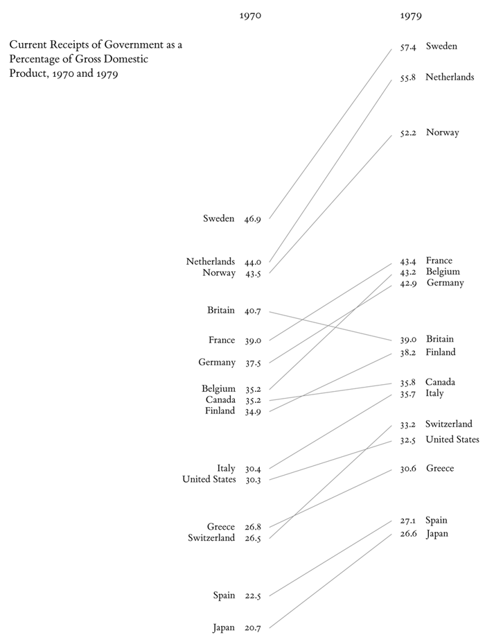

## Introduction

This is one of a series of posts where I focus on visualisations and techniques that I like. I'll look at a particular kind of visualisation that may be less familiar than tables, bar charts or line graphs, and work through some ways of making it using R..


## What are slopegraphs?

Slopegraphs are simplified line charts that only plot the change between two points. 
They were originally [invented by Edward Tufte](https://charliepark.org/slopegraphs/) in the 1980s; although they weren't much used by 2011, they have become more popular in recent years.




They're often very effective (and efficient) at visualising *paired data* of some kind, such as "before" and "after" points in time, or comparing a paired category such as male/female.


## Prepare the data

This post uses a dataset of Cheshire Quarter Sessions petitions from [The Power of Petitioning](https://doi.org/10.5281/zenodo.7027692).


(Code is shown by default since the focus is on methods, but if you're not interested in that, you can hide it by clicking on &#x25BC; above each code chunk.)


```{r includes}
#| code-fold: true

library(scales) 
library(janitor) 
#library(readxl)
#library(glue)
library(tidyverse)

library(ggthemes)
library(ggrepel)
theme_set(theme_minimal())  

library(mindseyedata)

```


Let's say I'd like to know if there were differences in the distribution of petition topics before and after the Civil Wars and Revolution (1642-49). I'll filter out small numbers of petitions from the 16th and 18th centuries, and also remove some topics with very small numbers to make the chart more readable. The 17th-century data is a sample of years ending in -8, so it makes most sense to split into 1608-48 and 1658-98. As the two groups aren't exactly the same size, I want percentages of each group rather than numbers. (A final step is to make a single set of labels for the topics.)


```{r}
cheshire_petitions_topics <-
cheshire_petitions |>
  select(petition_id, year, topic) |>
  filter(between(year, 1600, 1700)) |>
  filter(n()>20, .by = topic) |> 
  mutate(period = if_else(year<1648, "1608-48", "1658-98")) |>
  count(period, topic) |>
  group_by(period) |>
  mutate(pct=n/sum(n)) |>
  ungroup() 

# text labels
# for labels on the left
cheshire_petitions_p1 <-
cheshire_petitions_topics |> 
  filter(period=="1608-48") |>
  select(period, topic, pct)
```


```{r}
cheshire_petitions_topics |>
  knitr::kable() |>
  kableExtra::kable_styling()
```


## Making slopegraphs with ggplot

At its core a ggplot-based slopegraph is quite simple: it's just a combined line and scatter chart plotting the two pct points for each group. Then it's a matter of making adjustments to improve appearance and communication, which can vary a lot from one dataset to another.

A completely untweaked version:

```{r}
cheshire_petitions_topics |>
  ggplot(aes(x=period, y=pct, group=topic)) +
  geom_line(aes(colour=topic)) +
  geom_point(aes(colour=topic))
```

OK so far, but there's a lot of wasted space, unwanted grid lines, and it's not very easy to match the lines to the labels in the legend. 

The first thing to do is drop the legend and add text labels right next to the points where they'll be easier to read. 
To avoid overlapping text, I use [geom_text_repel()](https://ggrepel.slowkow.com/reference/geom_text_repel) from the [ggrepel](https://ggrepel.slowkow.com/) package. Most often I only want labels on one side of the chart; if I put them on the left (which I preferred in this case) I want to switch the axis labels to the right.

```{r}
p1 <-
cheshire_petitions_topics |>
  ggplot(aes(x=period, y=pct, group=topic)) +
  geom_line(aes(colour=topic)) +
  geom_point(aes(colour=topic)) +
  # add text labels on left hand side of the chart
  geom_text_repel(
    data=cheshire_petitions_p1,
    aes(label=topic, colour=topic),
    nudge_x = -0.6, # adjust space between label and chart
    size=4, # adjust label size
    min.segment.length = 0,
    segment.color = "lightgrey",
    seed = 42,
    direction = "y") +
  # swap axis labels to the right hand side for better use of space
  # and make them %ages
  scale_y_continuous(position = "right", labels = percent_format()) +
  # theme tweaks for appearance
  theme(legend.position = "none", # remove all legends
        aspect.ratio=4/3 # make chart taller and narrower
        ) + 
  labs(x=NULL, title="Cheshire petitions topics")


p1
```

The final tweaks to adjust space and positioning tend to be the fiddliest bit. But the Joy of ggplot is that you can adjust almost anything.

```{r}
p1 +
  # better colours (from ggthemes package)
  scale_colour_ptol() +
  # reduce unwanted space around the chart
  scale_x_discrete(expand = c(0.1, 0, 0.15, 0)) + 
  # remove unwanted lines
  theme(panel.border = element_blank(), 
        panel.grid.minor.y = element_blank(),
        panel.grid.major.y=element_blank(),
        axis.ticks = element_blank()) + 
  labs(y="% of petitions")
  
```

So I can see there were some major changes between the two periods: petitions about litigation declined massively, while petitions about rates (taxes, etc) and poor relief increased quite a bit, though less dramatically. The other categories changed only slightly.

An alternative way to do this is using *rankings* rather than percentages. 

```{r}
cheshire_petitions_topics_rankings <-
cheshire_petitions_topics |>
  group_by(period) |>
  arrange(-n, .by_group = TRUE) |>
  mutate(r = row_number()) |>
  ungroup() |>
  mutate(rank = fct_rev(as.factor(r)))

# two lots of text labels this time
cheshire_petitions_topics_rankings_p1 <-
cheshire_petitions_topics_rankings |> 
  filter(period=="1608-48")

cheshire_petitions_topics_rankings_p2 <-
cheshire_petitions_topics_rankings |> 
  filter(period=="1658-98")
```

This time round I felt that the chart was clearer with text labels on both sides of the chart. I also think I like it better without the vertical y axis lines.

I like the simplicity of the message using rankings, although I think it's probably sacrificed a bit too much information on this occasion: it underplays some large changes (like litigation) and slightly exaggerates others (like paternity).

```{r}
cheshire_petitions_topics_rankings |>
  ggplot(aes(x=period, y=rank, group=topic)) +
  geom_line(aes(colour=topic)) +
  geom_point(aes(colour=topic)) +
  # don't need to worry about overlapping labels this time
  # text labels for 1608-48 on left hand side
  geom_text(data = cheshire_petitions_topics_rankings_p1, 
            aes(label=topic, colour = topic),
            nudge_x = -0.08, hjust="right") +
  # and for 1658-98 on the right
  geom_text(data = cheshire_petitions_topics_rankings_p2, 
            aes(label=topic, colour = topic),
            nudge_x = 0.08, hjust="left") +
  # rank numbers as labels, with rounded edges
  geom_label(aes(label=rank), label.r = unit(0.4, "lines") ) +
  theme(legend.position = "none", 
        aspect.ratio=10/9 
        ) + 
  scale_colour_ptol() +
  scale_x_discrete(expand = c(0.7, 0, 0.7, 0), position = "top") + 
  theme(panel.border = element_blank(), 
        panel.grid.minor.y = element_blank(),
        panel.grid.major = element_blank(), # remove both x & y this time
        axis.ticks = element_blank()) + 
  # remove x axis text/title
  theme(axis.title.y = element_blank(),
        axis.text.y = element_blank()) +
  # tweak period labels
  theme(axis.text.x.top = element_text(size=12, margin = margin(10,0,0,0)) ) +

  labs(x=NULL, title="Cheshire petitions topics")
```


## Possible ggplot extensions

(I haven't tried any of these.)

- [newggslopegraph (CGPfunctions package)](https://ibecav.github.io/CGPfunctions/articles/Using-newggslopegraph.html)
- [ggslopegraph()](https://github.com/leeper/slopegraph)


## Further reading

- [Slopegraphs and R -- A pleasant diversion](https://ibecav.github.io/slopegraph/)
